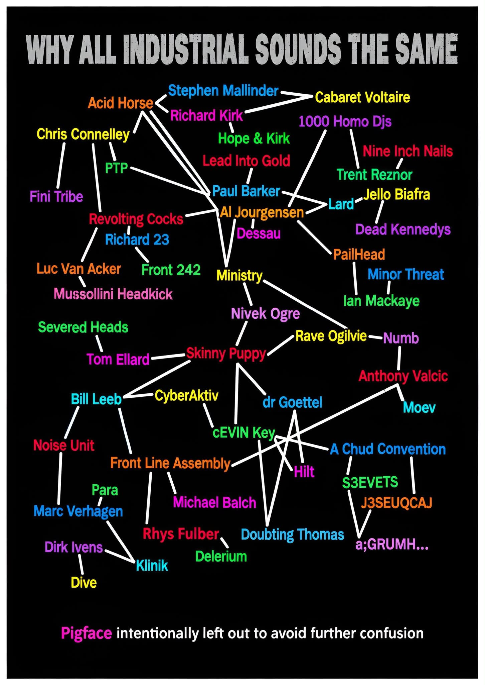

# Knowledge Graph of Industrial Music

Wax Trax posted it as a meme.

I made the first iteration.  If you know how GitHub works, and have something to contribute, let me know.

## The meme that triggered this project

[](https://www.facebook.com/groups/WaxTraxRecords1980/posts/2594226704425911/)

This project began by reverse-engineering and expanding the relationship web in the image above. [View the original post on Facebook.](https://www.facebook.com/groups/WaxTraxRecords1980/posts/2594226704425911/)

## Cloud development

This repository is ready for [GitHub Codespaces](https://github.com/features/codespaces).
Open the repository in a Codespace, then run:

```sh
npm run dev
```

Codespaces automatically forwards the preview on port 4173. Run `npm run build` to create a production build in `dist/`.

## The graph

The first working explorer is a static Vite application. Its portable graph lives in `data/industrial-graph.json` and is bundled at build time; no database, server, or hosted application is required. Run `npm run validate` before changing graph data, then `npm run dev` to explore it locally.

The seed graph is intentionally small and labels every relationship as `needs-citation` until its evidence is curated. See `docs/product-scope.md` for the industrial relevance boundary and data rules.

## Publishing

Merges to `main` build and deploy the site through GitHub Pages. In the repository settings, set **Pages → Build and deployment → Source** to **GitHub Actions** once. The public site will then be available at `https://dphunct.github.io/Knowledge-Graph-of-Industrial-Music/`.
